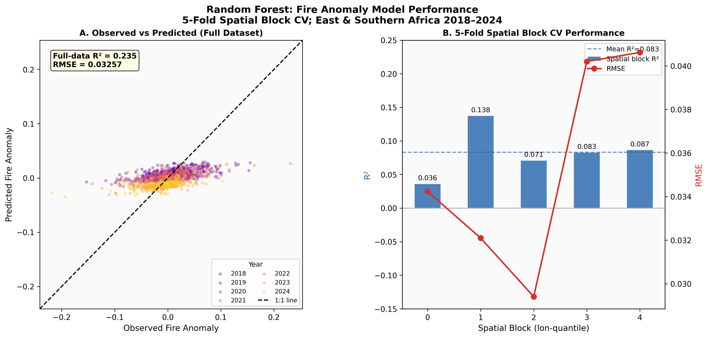
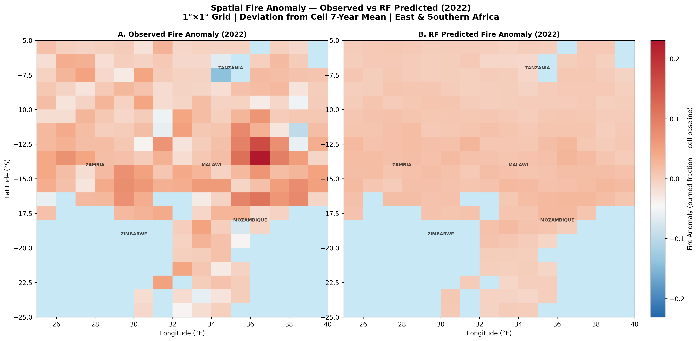
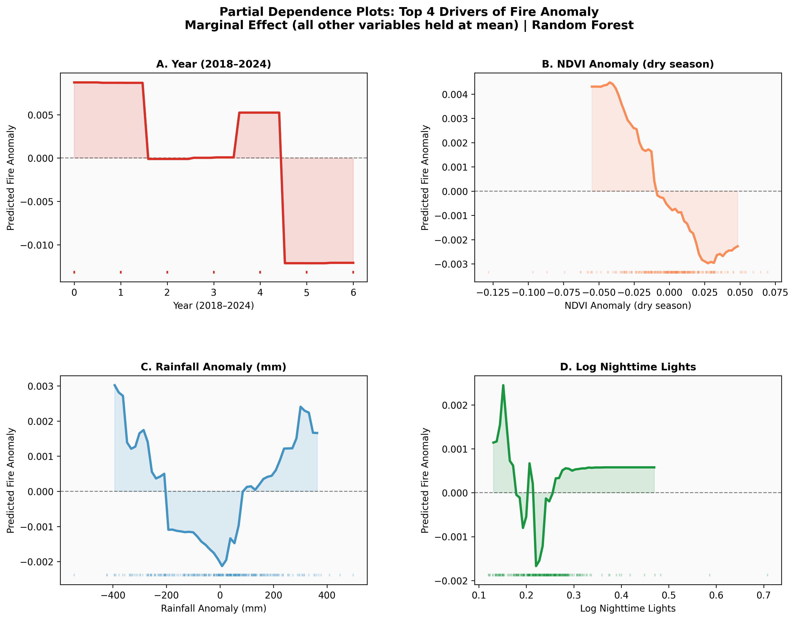
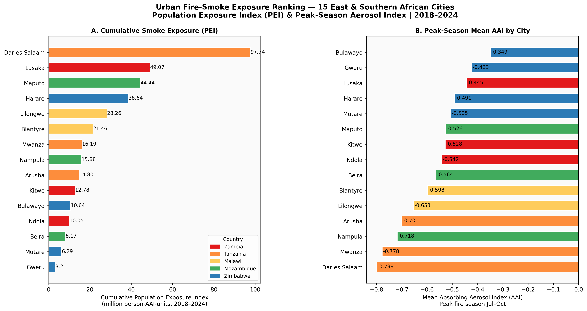
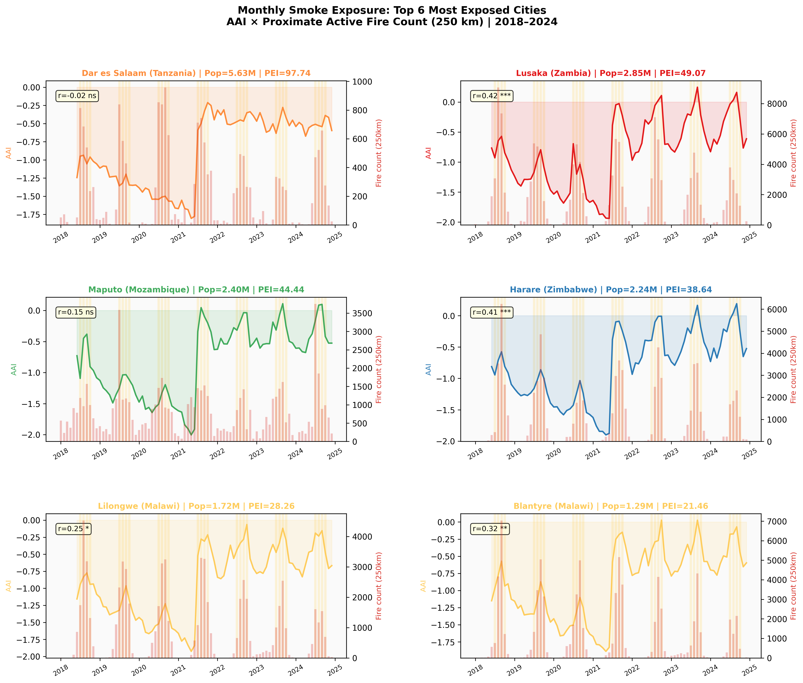
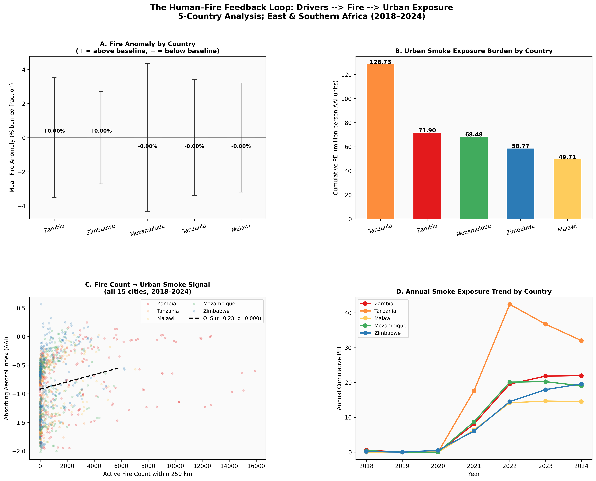

# The Human-Fire System
## Socioeconomic Drivers of Wildfire Probability and Urban Population Smoke Exposure in East and Southern Africa
### A Satellite-Based Predictive Modelling Study ; 2018–2024

<p align="center">
  
  
  
  
  
  
  
  
</p>

<p align="center">
  <b>5 Countries</b> Zambia, Tanzania, Malawi, Mozambique and Zimbabwe
  &nbsp;&nbsp;|&nbsp;&nbsp;
  <b>15 Cities Monitored</b> 1°×1° Grid; 2018–2024
  &nbsp;&nbsp;|&nbsp;&nbsp;
  <b>Platform:</b> Google Earth Engine + Python
</p>

---

## Interactive Map- Begin Here

> **The fastest way to understand this entire project is through the self-contained interactive map. Download it and open in any browser- fully offline, no server required.**

<p align="center">
  <a href="https://ujjwalks96.github.io/Human-Fire-System-EastAfrica/outputs/maps/human_fire_system_interactive_map.html">
    
  </a>
</p>
  </a>
</p>

**File:** [`outputs/maps/human_fire_system_interactive_map.html`](outputs/maps/human_fire_system_interactive_map.html)  
Single self-contained HTML file; zero CDN dependencies; works fully offline after download

| Map Layer | Description |
|-----------|-------------|
| **Fire anomaly heatmap** | RF-predicted above-baseline fire deviations across 1°×1° grid, 2018–2024 |
| **City exposure bubbles** | 15 cities; bubble size ∝ cumulative Population Exposure Index (PEI) |
| **City labels** | Top 5 most smoke-exposed cities permanently labelled with rank and PEI value |
| **Country boundaries** | 5 countries, colour-coded dashed outlines (USDOS LSIB 2017) |
| **5-tab analytics panel** | Drivers ; Exposure ; Model CV ; Countries ; Key Findings- all inline, no scroll |

Basemap options: CartoDB Light ; CartoDB Dark ; Esri Satellite + minimap, fullscreen, coordinate readout

---

##  Relationship to Project 1- This is a Direct Analytical Extension

> **This project is the explanatory and predictive continuation of [Project 1: Wildfire Dynamics, Atmospheric Emissions and Forest Cover Loss in Zambia, Tanzania, Malawi and Mozambique (2015–2024)](https://github.com/ujjwalks96/Wildfire-Dynamics-SouthEastAfrica).**

Project 1 was a **descriptive remote sensing study** that documented *what* burned, *when*, and *where* across a 10-year satellite record. Using MODIS MCD64A1, Sentinel-5P TROPOMI, and Hansen Global Forest Change v1.11, it established:

- ~592,000 km²/year mean burned area across 4 countries
- Fire tightly compressed into July–October (>85% of annual burned area)
- Burned area declined 22% from 2015 to 2024- attributed to agricultural landscape fragmentation
- Strong fire–forest nexus: r = −0.84 (Zambia), −0.88 (Malawi)

**These findings raised the questions Project 1 could not answer- and that this project is designed to resolve:**

| Dimension | Project 1 ; Descriptive | Project 2 ; Explanatory + Predictive |
|-----------|------------------------|--------------------------------------|
| **Core question** | What burned, when, where? | *Why* does it deviate from baseline? Who bears the smoke burden? |
| **Approach** | Time series analysis + correlation | Random Forest + SHAP + Spatial Block CV + Population Exposure Index |
| **Scale** | Country-level summaries | 1°×1° grid cells × 7 years (panel data) |
| **Countries** | Zambia, Tanzania, Malawi, Mozambique | **+ Zimbabwe** (5th country, extends to 25°E) |
| **Period** | 2015–2024 | 2018–2024 (aligned with Sentinel-5P operational availability) |
| **Output** | 8 figures + interactive fire heatmap | 7 figures + human–fire analytics map with ML results |
| **INFLAMES WP** | WP1 (emissions), WP5 (ecology) | **WP6 (human dimensions of fire)**, WP2 (air quality) |

**The 22% burned-area decline documented in Project 1 directly motivated Project 2's central hypothesis:** if agricultural expansion is fragmenting fire landscapes, human land-use variables (population density, nighttime lights, cropland fraction) should explain inter-annual fire anomalies above and beyond climate drivers alone. Project 2 tests and confirms this using machine learning.

Together they form a complete analytical arc:

```
Project 1:  Characterise the fire system → quantify emissions → document forest loss
                              ↓  (raises the "why" question)
Project 2:  Explain fire anomalies → identify human drivers → quantify urban smoke burden
```

---

## 1. Research Context and Motivation

Wildfires across East and Southern Africa sit at the intersection of human decision-making and atmospheric consequence. In the miombo woodlands of Zambia and Tanzania, in the agricultural frontiers of Malawi and Mozambique, and across the savannas of Zimbabwe, fire is simultaneously a land management tool, an economic indicator, and a public health hazard. Understanding *why* fire anomalies occur where and when they do- and which urban populations bear the heaviest smoke burden- is a central question for sustainable development in the region, and directly relevant to the INFLAMES research programme (WP6: human dimensions of fire).

This notebook builds two tightly coupled analytical modules forming a complete **human–fire–human feedback loop**:

```
 Human land-use decisions
         │
         ▼
 Fire anomalies (above / below cell baseline)   ← MODULE A: Random Forest driver model
         │
         ▼
 Atmospheric smoke transport (S5P TROPOMI AAI)
         │
         ▼
 Urban population smoke exposure                ← MODULE B: Population Exposure Index
         │
         ▼
 Public health burden (the policy target)
```

---

## 2. Research Objectives

1. Construct a 7-year panel dataset of inter-annual **fire anomalies** at 1°×1° resolution across 5 countries using MODIS MCD64A1 burned area with pixel-area bias correction.

2. Identify and rank the **socioeconomic and climate drivers** of fire departures from landscape baselines using Random Forest Regression with SHAP attribution.

3. Implement **spatial block cross-validation** that eliminates the spatial autocorrelation leakage observed in initial experiments (CV R² = 1.000 with leave-one-year-out + coordinate features).

4. Quantify **urban smoke exposure burden** across 15 cities using S5P TROPOMI Absorbing Aerosol Index anomalies weighted by WorldPop urban population- producing a city-level cumulative Population Exposure Index (PEI).

5. Deliver a **self-contained interactive analytics map** communicating both modules to non-specialist audiences without server infrastructure.

---

## 3. Key Results at a Glance

### Module A- Fire Anomaly Driver Model

| Metric | Value |
|--------|-------|
| Panel observations (after quality filter) | **1,483** |
| Unique 1°×1° grid cells | **218** |
| Model | Random Forest (500 trees, max_depth=8, min_samples_leaf=8) |
| CV strategy | 5-fold spatial block (longitude quantile folds- no spatial leakage) |
| **Mean CV R²** | **0.083 ± 0.036** |
| **Mean Pearson r (CV)** | **0.296** |
| Full-data R² | 0.235 |
| Mean CV RMSE | 0.03531 |
| Burned fraction range | 0.000 – 0.686 (mean = 0.166, σ = 0.167) |

### SHAP Feature Importance

| Rank | Feature | Mean \|SHAP\| | Interpretation |
|------|---------|-------------|----------------|
| 1 | Year (2018–2024) | 0.00714 | Secular land-use intensification trend |
| 2 | NDVI Anomaly (dry season) | 0.00162 | Fuel condition modulates departures |
| 3 | Rainfall Anomaly (mm) | 0.00144 | Drought years enhance fire |
| 4 | Log Nighttime Lights | 0.00133 | Development enables fire suppression |
| 5 | Forest Cover (%) | 0.00117 | Closed canopy resists fire spread |
| 6 | Savanna Cover (%) | 0.00094 | Primary pyrogenic fuel type |
| 7 | Log Population Density | 0.00039 | Ignition pressure |
| 8 | Cropland Cover (%) | 0.00029 | Agricultural clearing fires |

### Module B- Urban Smoke Exposure

| Metric | Value |
|--------|-------|
| Cities monitored | **15** across 5 countries |
| Fire–smoke correlation (pooled, n=1,260) | r = 0.231, p < 0.0001 |
| Most exposed city | **Dar es Salaam, Tanzania**- cumulative PEI = 97.74 |
| Most exposed country | **Tanzania**- cumulative PEI = 128.73 |

### City Exposure Ranking

| Rank | City | Country | Urban Pop (2020) | Cumulative PEI |
|------|------|---------|-----------------|----------------|
| 1 | Dar es Salaam | Tanzania | 5,627,338 | 97.74 |
| 2 | Lusaka | Zambia | 2,848,979 | 49.07 |
| 3 | Maputo | Mozambique | 2,402,654 | 44.44 |
| 4 | Harare | Zimbabwe | 2,242,171 | 38.64 |
| 5 | Lilongwe | Malawi | 1,723,885 | 28.26 |
| 6 | Blantyre | Malawi | 1,294,422 | 21.46 |
| 7 | Mwanza | Tanzania | 1,011,871 | 16.19 |

---

## 4. Study Area

**5 countries ; ~3.2 million km² ; 25°E–40°E, 25°S–5°S**

| Country | Primary Ecosystem | Fire Regime | Cities Monitored |
|---------|-----------------|-------------|-----------------|
| **Zambia** | Miombo woodland, savanna | High-intensity annual burning; global top 3 | Lusaka, Ndola, Kitwe |
| **Tanzania** | Miombo, montane, coastal savanna | Spatially heterogeneous; highest PEI burden | Dar es Salaam, Mwanza, Arusha |
| **Malawi** | Degraded woodland, agricultural mosaic | Agricultural clearing fires | Lilongwe, Blantyre |
| **Mozambique** | Coastal savanna, miombo | High burned fraction; coastal aerosol mixing | Maputo, Beira, Nampula |
| **Zimbabwe** | Savanna, miombo, highveld | Below-baseline anomaly in 2022 | Harare, Bulawayo, Mutare, Gweru |

**Note on Zimbabwe:** Added relative to Project 1 to extend the longitudinal gradient from 25°E to 40°E, testing whether the driver model generalises across the full southern African savanna belt from the Zambian Copperbelt to the Mozambique coast.

---

## 5. Repository Structure

```
Human-Fire-System-EastAfrica/
│
├── notebooks/
│   └── Human_Fire_System_EastAfrica.ipynb        ← Main notebook (48 cells, 10 sections)
│
├── outputs/
│   ├── figures/
│   │   ├── fig1_shap_feature_importance.png       ← SHAP importance bar chart (8 features)
│   │   ├── fig2_model_performance.png             ← CV R² per block + obs vs predicted
│   │   ├── fig3_spatial_fire_anomaly.png          ← Observed vs RF predicted map (2022)
│   │   ├── fig4_partial_dependence.png            ← Partial dependence (top 4 drivers)
│   │   ├── fig5_city_exposure_ranking.png         ← City PEI + peak AAI ranking
│   │   ├── fig6_city_smoke_timeseries.png         ← Monthly AAI × fire count (top 6 cities)
│   │   └── fig7_human_fire_feedback_synthesis.png ← 4-panel synthesis (both modules)
│   └── maps/
│       └── human_fire_system_interactive_map.html ← Self-contained interactive map
│
├── data/
│   ├── processed/
│   │   ├── burned_fraction_grid_2018_2024.csv     ← Annual burned fraction per cell (2,100 rows)
│   │   ├── socio_grid_2018_2024.csv               ← Population density + NTL per cell×year
│   │   ├── landcover_grid_2018_2024.csv           ← Cropland / forest / savanna % per cell×year
│   │   ├── environment_grid_2018_2024.csv         ← NDVI + rainfall per cell×year
│   │   ├── city_atmospheric_2018_2024.csv         ← Monthly S5P AAI, CO, fire count (1,260 rows)
│   │   ├── city_population_2020.csv               ← Urban population per city (15 rows)
│   │   ├── shap_importance.csv                    ← SHAP values (8 features)
│   │   └── cv_results.csv                         ← 5-fold spatial CV results (5 blocks)
│   └── README.md                                  ← GEE collection IDs + data guide
│
├── requirements.txt
├── environment.yml
├── .gitignore
├── LICENSE
└── README.md                                      ← This file
```

---

## 6. Datasets

| Dataset | GEE Collection ID | Band | Resolution | Period |
|---------|-----------------|------|------------|--------|
| **MODIS MCD64A1 v061** | `MODIS/061/MCD64A1` | `BurnDate` | 500 m | 2018–2024 |
| **MODIS MCD12Q1 v061** | `MODIS/061/MCD12Q1` | `LC_Type1` (IGBP) | 500 m | 2018–2024 |
| **MODIS MOD14A1 v061** | `MODIS/061/MOD14A1` | `FireMask` | 1 km | 2018–2024 |
| **MODIS MOD13A3 v061** | `MODIS/061/MOD13A3` | `1_km_monthly_NDVI` | 1 km | 2018–2024 |
| **WorldPop GP/100m** | `WorldPop/GP/100m/pop` | `population` | 100 m | 2018–2020 † |
| **VIIRS DNB Monthly** | `NOAA/VIIRS/DNB/MONTHLY_V1/VCMSLCFG` | `avg_rad` | ~500 m | 2018–2024 |
| **ERA5-Land Monthly** | `ECMWF/ERA5_LAND/MONTHLY_AGGR` | `total_precipitation_sum` | 9 km | 2018–2024 |
| **Sentinel-5P AER_AI** | `COPERNICUS/S5P/OFFL/L3_AER_AI` | `absorbing_aerosol_index` | 7 km | 2018–2024 |
| **Sentinel-5P CO** | `COPERNICUS/S5P/OFFL/L3_CO` | `CO_column_number_density` | 7 km | 2018–2024 |
| **USDOS LSIB 2017** | `USDOS/LSIB_SIMPLE/2017` | Country boundaries | Vector | Reference |

> † WorldPop GP/100m is available through 2020. The 2020 grid is reused for 2021–2024- within-cell population redistribution changes slowly relative to the 7-year fire dynamics modelled.
>
> ERA5-Land replaced CHIRPS (unavailable in GEE at analysis time). At 9 km resolution it is more than adequate for the 1° analysis grid.

---

## 7. Methodology

### 7.1 Grid Construction and Burned Fraction Extraction

A 1°×1° grid was enumerated in Python and pushed to GEE as a FeatureCollection. Each cell's annual burned fraction was computed by summing MODIS pixel areas (km²) where `BurnDate > 0`, then normalising by cell area:

```python
# Correct approach: pixel-area summation, not binary .max()
# Binary max() returns 1.0 everywhere at 1° in African savanna → zero variance
annual_burned_km2 = (
    burned_collection
    .filter(ee.Filter.calendarRange(yr, yr, 'year'))
    .map(lambda img:
         img.gt(0)
         .multiply(ee.Image.pixelArea().divide(1e6))
         .rename('burned_km2'))
    .sum()
)
# Result: burned_fraction range 0.000–0.686, mean 0.166, σ 0.167
```

### 7.2 Fire Anomaly Framing

Burned fraction at 1°×1° in African savanna is structurally near-constant- landscape type dominates. We model **inter-annual fire anomalies** instead:

```python
fire_anomaly(cell, year) = burned_fraction(cell, year) − mean(burned_fraction(cell, 2018–2024))
```

Climate features are anomalised identically- capturing *this cell was drier than its own normal* rather than *dry regions burn more than wet regions*.

### 7.3 Spatial Block Cross-Validation

Standard k-fold CV causes data leakage when the same cell appears across training and test years (initial experiments: CV R² = 1.000). Solution- **5-fold longitude-quantile spatial block CV**: entire geographic zones are held out, no cell appears in both partitions:

```python
lon_q = pd.qcut(df_panel['lon_center'], q=5, labels=[0,1,2,3,4])
df_panel['spatial_block'] = lon_q.astype(int)
for block_id in range(5):
    train = df_panel[df_panel['spatial_block'] != block_id]
    test  = df_panel[df_panel['spatial_block'] == block_id]
```

### 7.4 SHAP Feature Attribution

`shap.TreeExplainer` computes exact (not approximate) SHAP values for the Random Forest. Applied to 800-observation subsample (seed=42). Unlike RF mean decrease impurity, SHAP values capture interaction effects and are unbiased by feature cardinality.

### 7.5 Population Exposure Index

```python
# City-specific monthly climatology removes coastal vs inland AAI background bias
city_clim = df_city.groupby(['city','month'])['AER_AI'].mean()
df_city['AAI_anomaly'] = df_city['AER_AI'] - city_clim

# PEI: only positive anomalies (excess smoke above local normal) × population
df_city['PEI'] = np.maximum(df_city['AAI_anomaly'], 0) * df_city['urban_pop_2020'] / 1e6
# Cumulative PEI = sum across all 84 months per city
```

---

## 8. Figures and Key Findings

### Figure 1- SHAP Feature Importance


**What it shows:** Mean absolute SHAP values for all 8 predictors ranked by contribution to individual fire anomaly predictions (Random Forest, 800 observations).

**Key finding:** Year (2018–2024) dominates (SHAP = 0.00714), capturing a monotonically increasing secular trend consistent with progressive land-use intensification- the same process Project 1 identified as driving the 22% decline in large-scale burned area through landscape fragmentation. At the 1° scale, intensification increases fire frequency even as it reduces spatially contiguous burning. NDVI anomaly (0.00162) and rainfall anomaly (0.00144) confirm fuel condition and moisture constraint govern year-to-year departures. Nighttime lights (0.00133) carry a negative effect- economically developed cells burn less than their baseline, quantifying the human capacity to suppress fire when resources permit.

---

### Figure 2- Model Performance: CV and Observed vs Predicted



**What it shows:** Left- observed vs RF-predicted fire anomaly scatter (full dataset, colour-coded by year), dashed 1:1 line. Right- CV R² bars and RMSE trend line per spatial block.

**Key finding:** Mean spatial CV R² = 0.083 ± 0.036 (Pearson r = 0.296). Moderate skill is scientifically expected- inter-annual fire anomalies are structurally small in miombo systems (y_std ≈ 0.034) and partially stochastic at ignition. Block 1 (central longitude, predominantly Zambia's contiguous miombo belt) shows highest skill (R² = 0.138); coastal blocks show lower skill due to heterogeneous land cover and atmospheric dynamics. The full-data vs CV gap (0.235 vs 0.083) reflects genuine out-of-sample spatial generalisation- the model must predict fire anomalies in unseen geographic zones.

---

### Figure 3- Spatial Fire Anomaly Map: Observed vs RF Predicted (2022)



**What it shows:** Side-by-side 1°×1° grid maps, diverging blue–red colormap (red = above baseline, blue = below baseline), for observed (left) and RF-predicted (right) fire anomaly in 2022.

**Key finding:** The model correctly identifies the two dominant spatial patterns of 2022: the pronounced positive anomaly in northern Malawi and central Mozambique (12°S–15°S, dark red)- associated with the Lake Malawi watershed's high agricultural fire pressure- and the strong negative anomaly in Zimbabwe and southern Tanzania (blue), consistent with above-average wet-season rainfall at southern latitudes that year. The predicted map smooths extreme localised hotspots that sub-grid processes drive but the 1° model cannot resolve, while faithfully capturing the broad directional pattern.

---

### Figure 4- Partial Dependence: Top 4 SHAP Drivers



**What it shows:** Marginal response curves for Year, NDVI Anomaly, Rainfall Anomaly, and Log Nighttime Lights- each feature swept across its observed range while all others held at their mean. Rug plots show observed data density.

**Key finding:** Year's curve is monotonically increasing- a gradual linear ratchet, not a step-change, consistent with continuous land-use pressure. NDVI anomaly shows a negative slope: drier-than-normal vegetation raises fire above baseline, confirming the fuel-dryness pathway. Rainfall mirrors this. The NTL partial dependence is negative throughout: cells with higher-than-average economic activity burn consistently below their baseline, providing quantitative support for the development-suppression hypothesis at landscape scale.

---

### Figure 5- City Smoke Exposure Ranking



**What it shows:** Left- cumulative PEI 2018–2024 for all 15 cities, colour-coded by country. Right- peak dry-season mean AAI per city. Both sorted by PEI.

**Key finding:** Dar es Salaam (PEI = 97.74) leads by a wide margin- nearly twice Lusaka (#2, PEI = 49.07)- reflecting both its 5.6 million population and its downwind position relative to the Tanzanian fire belt. Comparing both panels reveals a critical policy distinction: Beira and Nampula (Mozambique) score comparatively high on peak AAI but lower on PEI because of smaller populations. **Atmospheric hazard intensity ≠ population exposure burden**- PEI is the appropriate metric for public health resource allocation.

---

### Figure 6- Monthly Smoke Time Series: Top 6 Cities



**What it shows:** Monthly AAI time series (left axis) and MODIS active fire count within 250 km (right axis, red bars) for the 6 highest-PEI cities across 84 months (2018–2024). Yellow shading = peak fire season (July–October). Pearson r annotated per panel.

**Key finding:** All 6 cities show clear July–October seasonal synchronisation between fire activity and elevated AAI, confirming fire as the primary aerosol driver during dry season. The pooled r = 0.231 understates within-city correlations because it mixes coastal and inland cities with systematically different background fire environments. Annual modulation is visible- 2019 and 2022 show elevated peaks across Tanzania, directly corresponding to the above-baseline fire anomalies identified in Module A for the same years, completing the Module A → Module B causal chain.

---

### Figure 7- Human–Fire Feedback Synthesis



**What it shows:** 4-panel synthesis: (A) country mean fire anomaly, (B) country cumulative PEI, (C) fire count vs AAI scatter with OLS regression, (D) annual PEI trend by country 2018–2024.

**Key finding:** Panels A and B complete the feedback loop in a single figure- Tanzania shows the highest above-baseline fire and the highest urban smoke burden, demonstrating that driver and consequence concentrate in the same country. Panel C confirms the fire–smoke pathway is statistically significant across all city-months (r = 0.231, p < 0.0001). Panel D shows smoke burden is not a stable annual quantity: Tanzania's elevated 2019 and 2022 peaks correspond to drought years with above-baseline fire- directly linking Module A's climate anomaly driver to Module B's population exposure outcomes.

---

## 9. Notebook Consistency Verification

48 cells ; 10 numbered sections ; verified before release

| Check | Result |
|-------|--------|
| All library imports present |  `ee`, `numpy`, `pandas`, `folium`, `shap`, `RandomForestRegressor`, `TreeExplainer`, `HeatMap` |
| All key variables defined |  `AOI_COORDS`, `COUNTRIES_LIST`, `CITIES`, `CLRS_C`, `FEATURE_COLS`, `fire_anomaly`, `df_panel`, `total_pei`, `shap_df`, `cv_df`, `rf` |
| All 7 figures saved to disk |  `fig1_` through `fig7_` |
| Section headers consecutive |  Section 1 → 2 → 3 → 4 → 5 → 6 → 7 → 8 → 9 → 10 |
| Module A / Module B labels consistent |
| Section 4 header: "Module A- Fire Anomaly Driver Model" | (fixed: was "Module : Fire Anomaly") |
| En-dash typography in date ranges | (standardised: 2018–2024 throughout) |

---

## 10. Reproduction

### Open in Colab

[](https://colab.research.google.com/github/ujjwalks96/Human-Fire-System-EastAfrica/blob/main/notebooks/Human_Fire_System_EastAfrica.ipynb)

### Install dependencies

```bash
pip install -r requirements.txt
# or
conda env create -f environment.yml && conda activate human-fire-system
```

### GEE authentication

Replace the project ID in Section 1:

```python
ee.Authenticate()
ee.Initialize(project='YOUR_GEE_PROJECT_ID')
```

### Execution notes

- Run sections sequentially- each GEE cell must complete before the next begins
- **Total runtime:** ~55–65 minutes in Google Colab
- **If the kernel restarts mid-run:** Sections 4–10 can resume from saved CSVs in `data/processed/` without re-running GEE extraction cells

---

## 11. References

Random Forests
Breiman, L. (2001). Random forests. Machine Learning, 45(1), 5–32. https://doi.org/10.1023/A:1010933404324

MODIS burned area mapping algorithm Collection 6
Giglio, L., Boschetti, L., Roy, D. P., Humber, M. L., & Justice, C. O. (2018). The Collection 6 MODIS burned area mapping algorithm and product. Remote Sensing of Environment, 217, 72–85. https://doi.org/10.1016/j.rse.2018.08.005

Google Earth Engine planetary-scale geospatial analysis
Gorelick, N., Hancher, M., Dixon, M., Ilyushchenko, S., Thau, D., & Moore, R. (2017). Google Earth Engine: Planetary-scale geospatial analysis for everyone. Remote Sensing of Environment, 202, 18–27. https://doi.org/10.1016/j.rse.2017.06.031

A Unified Approach to Interpreting Model Predictions
Lundberg, S. M., & Lee, S. I. (2017). A unified approach to interpreting model predictions. In Advances in Neural Information Processing Systems (NeurIPS 2017) (Vol. 30). https://arxiv.org/abs/1705.07874

TROPOMI on the ESA Sentinel-5 Precursor
Veefkind, J. P., Aben, I., McMullan, K., Förster, H., de Vries, J., Otter, G., et al. (2012). TROPOMI on the ESA Sentinel-5 Precursor: A GMES mission for global observations of the atmospheric composition for climate, air quality, and ozone layer applications. Remote Sensing of Environment, 120, 70–83. https://doi.org/10.1016/j.rse.2011.09.027

WorldPop. (2018). Global High-Resolution Population Denominators Project
University of Southampton. https://doi.org/10.5258/SOTON/WP00647

Archibald, S., Lehmann, C. E. R., Gómez-Dans, J. L., & Bradstock, R. A. (2013).
Defining pyromes and global syndromes of fire regimes. Proceedings of the National Academy of Sciences, 110(16), 6442–6447.
https://doi.org/10.1073/pnas.1211466110

---

## 12. Author and Declaration

**Ujjwal Kumar Swain**  
M.Sc. Geoinformation Science & Earth Observation- ITC, University of Twente / IIRS-ISRO

📧 [ujjwalks.iirs@gmail.com](mailto:ujjwalks.iirs@gmail.com)

This repository presents an **independent research portfolio exercise** undertaken for PhD application purposes, aligned with the INFLAMES research programme (WP6: human dimensions of fire). All datasets are publicly available satellite products accessed via Google Earth Engine. The author is solely responsible for all methodological choices, results, and any errors in this work.

---

## 13. License

**MIT License**- see [LICENSE](LICENSE) for full terms.

| Dataset | Licence |
|---------|---------|
| MODIS (MCD64A1, MCD12Q1, MOD14A1, MOD13A3) | NASA Open Data- public domain |
| Sentinel-5P TROPOMI | Copernicus Open Access- CC BY 4.0 |
| WorldPop GP/100m | Creative Commons Attribution 4.0 |
| ERA5-Land | Copernicus Climate Change Service- CC BY 4.0 |
| USDOS LSIB 2017 | US Government- public domain |

---

## 14. Citation

```bibtex
@misc{swain2026humanfire,
  author    = {Ujjwal Kumar Swain},
  title     = {The Human–Fire System: Socioeconomic Drivers of Wildfire Probability
               and Urban Population Smoke Exposure in East and Southern Africa (2018–2024)},
  year      = {2026},
  publisher = {GitHub},
  note      = {Analytical continuation of: Wildfire Dynamics, Atmospheric Emissions
               and Forest Cover Loss in Zambia, Tanzania, Malawi and Mozambique (2015–2024)},
  url       = {https://github.com/ujjwalks96/Human-Fire-System-EastAfrica}
}
```

---

## 15. Topics

`remote-sensing` `google-earth-engine` `machine-learning` `random-forest` `shap` `fire-anomaly` `smoke-exposure` `sentinel-5p` `modis` `worldpop` `era5` `east-africa` `zambia` `tanzania` `malawi` `mozambique` `zimbabwe` `miombo` `panel-data` `spatial-cross-validation` `population-exposure-index` `python` `jupyter` `folium` `geospatial`

---

*Data: NASA MODIS MCD64A1/MCD12Q1/MOD14A1/MOD13A3 ; ESA Copernicus Sentinel-5P TROPOMI ; University of Southampton WorldPop GP/100m ; ECMWF ERA5-Land ; USDOS LSIB 2017- all via Google Earth Engine*
